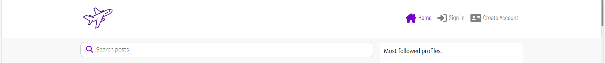
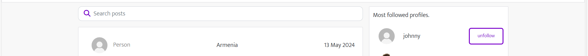
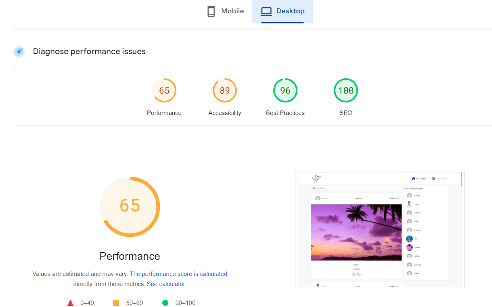

# Travelers Tails

Travelers Tails is a social media website aimed at travelers. It's purpose is centred around various traveler topics such as photos and videos of holidays, connecting with friends and community, and sharing your opinion on certain destinations. The goal of the project was to create a space that is interactive for the user so that they can better interact with their community, as well as share their own personal experiences.

# Design

In this section I will cover the overall design choices of this project.

## Design goals

The overall goal with the design of this project is to make it instantly recognisable what this project is about, create a space that is easy to understand and navigate where users can interact with the content posted as well as share their own videos and images, and share their opinions.

## Tools

This project was made using React, Django REST API, React-Bootstrap, and HTML/CSS

For this specific app, I used exclusively React, React-Bootstrap, and Axios. I have used more technology and packages on the backend API which I have documented in that ReadMe.

## Layout

This project has aimed to have a clear layout on both desktop and mobile, as well as medium sized screens. From the home page I wanted their to be an easy to understand nav bar at the top as well as a logo that makes it easy to understand the subject matter. It will then then go down into a search bar area for users to search by topic and have a search reault appear with all the post containing a key word search that also has an infinite scroll applied.

Under this the user will see the posts that have been created by users and this will also scroll infintely, there is an option to like but this action will only be able to be done if the user is logged in and they are not the owner of the post. The user will be able to see how many likes and comments a post has and be able to view the comments, but only leave one if they are also logged in. The posts will also have the country that the post was made in on top of the image video, and the users after can be clicked to be brought to their profile.

Depending on if the user is logged in or not this will change what the content of the nav bar are, if logged in they will have home, feed, notfications, and liked, as well as a create button to make new posts, where logged out users will have home, sign in, create account. This style will also change to a burger icon on smaller screens, except for create for logged in users which will be centred on the nav bar.

In the column to the right hand side will appear a box that shows the most popular accounts. If the user is logged in, each of these users will have a follow/unfollow button nect to them, depending on if the user is already following or not. When clicking these it will update the status and the button immediately. On smaller screens, this box will appear above the search bar and show the 4 most followed profiles, as well remove the follow/unfollow buttons as the styling of this did not match the rest of the site.

Next is the Create Account Page and the Sign In page. This pages are styled very similarly, and have a sunset location set as the background. On the create account page you are prompted to enter a username and fill in your password twice. If there are error such as mismatch password or a username that is already taken this will flag an error. If completed successfully, you are taken to the login page to fill in your credentials.

The next section is the Feed and the Liked sections, these are styled identically to the home page but for the feed will only show posts by users that you follow, and for the liked only show posts the user has already liked.

The next section is the notifications section, which will show the logged in user all the of the likes and comments they have received on posts. These are dispalyed in reverse chronological order and can be clicked to bring the user to the post that the notification is linked to. They will also be able to the see the notification senders username and profile avatar.

The profile section can be accessed through the nav bar for your own profile or by clicking another users profile to access theirs. These will be styled very similarly showing how many posts, followers, and following the user has as well as all of the posts they have made. If it is your account you will have the option to update bio and change username/password, and if it is another users you will have the option to follow/unfollow them.

Lastly is the create post section, this will give the user 4 fields to fill out being title, location, content, and upload image/video. For location specifically, a list of all countries will appear as well as a type function for the user to type in whichever country they are looking for to make navigation simple. This field is also identical to the edit post form.

## Colour Scheme

The colour scheme that I have used for this project is #7a00cc a solid shade of purple that I felt was not being used by many social media websites at the time of creation so would appear visually different, a mix of different grey and white tones for backgrounds and fonts as I felt this was very readable. I have also used some blue for button on click commands as this is colour people commonly associate with buttons when they are clicked to give visually feedback that their action has been made.

# Features

In this section I will be covering the various features I have implemented, who I had in mind when creating them, and why they are useful. This project is using a single-page React application on the frontend which gets data from the backend API.

These features will include a responsive design where the layout changes depending on screen size, like, comment, and follow functionality. A custom model that allows users to create their own posts using locations as well as images or videos. A custom model that enables notifications to be sent and received. Ability to edit profile pages and upload profile images. And an infinte scroll system that works across the home page, like page, the feed, with comments, and with notifications.

Feedback will also be given to users whenever they interact with the application, such as follow button being turned to unfollow button when clicked, and likes becoming coloured red hearts whenever they are clicked/unclicked.

# User Stories

- User Story 1: Create NavBar Component
- As a user, I want to see a navigation bar at the top of the website for easy access to different sections.

- User Story 2: Search Bar Implementation
- As a user, I want to search for other users, locations, or travel-related content using a search bar.

- User Story 3: Notifications
- As a user, I want to receive notifications for new likes, comments, or messages related to my posts or profile.

- User Story 4: Implementing login functionality
- As a user, I want to be able to access the login page to log in to my account.

- User Story 5: Logout functionality
* As a user, I want to be able to log out of my account securely when I'm done using the platform.

- User Story 6: Like/Unlike functionality
- As a user, I want to be able to like or dislike posts shared by other users.

- User Story 7: Commenting
- As a user, I want to comment on posts shared by other users to engage in conversations.

- User Story 8: Create post component
- As a user, I want to create and share posts about my travel experiences, including text, images, and videos.

- User Story 9: Implementing registration functionality
- As a user, I want to see a registration page where I can create a new account.

- User Story 10: Profile pictures
- As a user, I want to upload or change my profile picture to personalize my profile.

- User Story 11: Build user profiles
- As a user, I want to view my profile page with information about my travel experiences and activities.

- User Story 12: View other profiles
- As a user, I want to view profiles of other users, including their travel experiences and visited locations.

# Wireframes

Please see attached wireframes for the main pages of the project, being the home/feed/liked page, a post detail page, the profiles page, the notifications page, login/registration page, and create post page. These 6 pages are the main ones pages of the project. All have a very similar style for both large and small screens, with the main difference on small screens being the location of the suggested profiles, so I will only be showing the mobile for the home wireframes.

# Navigation Bar

- The navigation bar and logo

* Featured on every page.
* This was created to help the user flow of the website and allow the user to jump between each section at will without having to rely on back commands from the browser. The logo also acts as a home button if the user would like to use that.
* When on a page, the nav bar will have a purple colour to show the user which page they have selected
* Depending on if user is logged in or out, the options will differ. Both having home as an option but logged out users will have create account and sign in as options, where as logged in users will have feed, notification, liked, as well as their avatar which links to their profile page

# Search Bar

- Travelers Tails Search bar

* This is a clear searchbar where user can do specific key word searches

# Posts Section

- The Home page Section, Feed section, and Liked section

* This section has one continuous column set with infite scroll. This works the same on home, feed, and liked.
* In these you will see the user who posted, the location tag, the date it was posted, the image or video, and how many likes/comments each post has.
* The posts display in a chronological order and when clicked will bring you to the content of the posts

# Post Details

- The contents of each post

* When going into a post you will see a lot of the same imagery that you will see when viewing them on the feed.
* This includes user who posted, date posted, location, and the content itself.
* Beneath you will see the likes and comments
* You will be able to see all the comments which also scroll infinitely.
- If you are the creator of the post, you will also see 3 dots at the top right corner, this will give you the option to edit or permanently delete your post.

# Popular profiles section

- The popular profiles section dispalyed on most pages

* popular profiles section will dispay in a column on the right hand side when on a large screen, and in a small window on top of the page on small screens
* This section will contain the most followed profiles profile pictures and usernames
* On a large screen, the user will be able to follow/unfollow with one click
* On a small screen, this button will be removed, but you will still be able to click on the profile to be brough to that users page.

# Create / Edit Post form

- Form for post creation and editing

- A form that has 4 mandatory fields.
- The user will have to enter the title and content.
- For the location, they must select a country. A dropdown will appear with all countries as well as a bar for the user to type in a country so they do not have to scroll looking
- If the user is editing a post, all 4 fields will be filled out with what was there before.

# Notifications Page

- Page for Notifications

- This is the page where a users notifications will show up
- Each notification will show the user who sent the notifications avatar and username
- It will tell you which type of notification it is being either like or comment
- When you click on these notifications, it will take you to the post the notification is about.

# Profiles

- Profile pages

- The profile page is accessible in the navbar by clicking your after, or for someone else by clicking their profile.
- This section includes profile picture, stats on number of posts, followers, and following.
- If you are on your own profile, you will have the option to edit your bio, as well as change username and password.
- If on someone elses you will be able to follow/unfollow

# Profile

- The profile section can be accessed through the navbar for logged in users.
- It will have your profile picture (or a default image) in a circle on the top left, followed by your username
- Below this will be your basic info, or which ever users page your ons basic info
- This is info such as how long your vegan, a bio, interested, and favourite animal.
- If this is your page you will also see an edit, bookmark, and delete button.

# Login Page

- This is the login page for users who already have an account.
- It prompts for username and password.

# Registration Page

- This is the page for creating an account
- IT will check you have entered same password twice, as well as checking you have nnot entered a username that is already taken.

# 404 Error page

- A simple 404 page telling the user that this page does not exist.
- Includes navbar so user can get back easily

# Future Features

- There were a number of features that I would have liked to implement, but was not able to implement due to time constraints.
- One of these features was for the profile section to show a list of countries visited by the user. I intend on implementing this at a later stage
- Another feature was an interactive map for each users profile that dispalyed a map of all countries in the world and had the visited countried marked. I had decided that this may be outiside the scope of the project
- Another feature was to be able to click on the location from a post, and be taken to a page similar to liked where it shows all posts that have this location marked.
- Another was a setting feature, mostly for setting a profile to public or private.
- And lastly was a messaging feature, I began to implement this on the backend but due to time constraints was not able to complete.
- I wish to come back to these at a future date and get all implemented

# Testing

- Ran html through W3C validator without any errors

- Ran through Jigsaw css checker, no issues.

- Ran through JSHint, most pages have gotten small error but these are linked to ES11 and the pre-built code within React.

- Ran backend through Pep8 checker for Python and come back with mostly no errors. Some lines in settings.py could not be shortened, but these are the only errors.

- I have checked screen compatibility for phone and tablet, I have checked tablet by using the inspect tool and shrinking down to size and have tested on my own personal mobile to assure it is responsive.

# Bugs

Throughout the project I had encountered several bugs which I will give details of in this section.

Resolved bugs:

- An issue I encoutered was when starting out the project and setting up the registration page was gettting the custom image to work as a background. The issue I was having was that the container made it so two large white borders would appear, and this was not the style I wanted to go for. After some investigating, I figured out I would have to bypass the container by passing the image into app.js and using a useState variable, and chaging this state to block to achieve the style I wanted.
- Another issue I encountered was getting it set up so the user could not only post an image or video, but also change from one type of media to another in the edit form, I found the way to work around this was to add a video field in on the backend, and then creating a change media function and allowing the field to accept either images or videos.
- Another issue I faced was creating the notifications page, I was habing an issue with getting them to dispaly correctly and link to the post that the notification was linked to, as well as having trouble getting the users avatar to appear. To resolve this, I used the Avatar component which worked with rendering the profile images. When clicking on the notification it was taking me to a broken post, but after some investigating I found out the post it was taking me to was undefined, this was because I was handing in the wrong information, but once I corrected this it worked correctly.

Unresolved bugs:

- As far as I am aware there are no unresolved bugs in the project.

# Lighthouse Testing

# Full Manual Testing

The following devices were used during testing:

Desktop:

- Acer Aspire 5 17" screen

Tablet:

- iPad Air
- iPad Mini

Mobile Devices:

- iPhone 15
- iPhone 12
- iPhone 12 Pro
- Samsung Galaxy S8+

The following browsers were used during testing:

- Google Chrome
- Safari

All features that are on multiple pages (eg. Logo, Nav bar, Social media links) will only show up as tested in the first page they appear on, but have been tested on all pages.

All things that link to other pages, eg, posts or profile, have been tested that they bring to the correct page.

## Home page testing

<table>
    <tr>
        <th>Feature</th>
        <th>Expected Outcome</th>
        <th>Test</th>
        <th>Result</th>
        <th>Pass/Fail</th>
    </tr>
    <tr>
        <td>Logo</td>
        <td>When clicking logo takes back to home page</td>
        <td>Click logo</td>
        <td>Takes back to home page</td>
        <td>pass</td>
    </tr>
    <tr>
        <td>Nav bar highlight</td>
        <td>Hovered page on nav bar will change colour</td>
        <td>Hover over nav bar</td>
        <td>Changed colour</td>
        <td>pass</td>
    </tr>
    <tr>
        <td>Search Bar</td>
        <td>Search bar will find specific posts</td>
        <td>Typed different keywords into searchbar</td>
        <td>Related posts appeared</td>
        <td>pass</td>
    </tr>
    <tr>
        <td>Search Bar No results</td>
        <td>Search bar will show a no results image if not matching anything</td>
        <td>Typed random words into searchbar</td>
        <td>No posts appear, image saying nothing found</td>
        <td>pass</td>
    </tr>
    <tr>
        <td>Infinite Scroll</td>
        <td>When more than 10 posts, page will get longer to include more posts as reaching end</td>
        <td>Created more than 10 posts</td>
        <td>Side bar for scrolling got shorter as I scrolled down</td>
        <td>pass</td>
    </tr>
    <tr>
        <td>Nav bar changes when logged in</td>
        <td>When logged in, the nav bar options will change</td>
        <td>Log in and look at navbar</td>
        <td>Options changed to feed, notifications, liked, and profile avatar</td>
        <td>pass</td>
    </tr>
    <tr>
        <td>Like/Unlike from feed</td>
        <td>Posts can be liked by logged in user without clicking into post</td>
        <td>Like/Unlike a post</td>
        <td>Like/Unlike icon changed</td>
        <td>pass</td>
    </tr>
    <tr>
        <td>Follow/Unfollow from popular profiles section</td>
        <td>Profiles can be Followed/Unfollowed from popular profiles section</td>
        <td>Follow/Unfollow someone from popular profiles section</td>
        <td>Button changed to whatever the opposite was and stats changed on profile</td>
        <td>pass</td>
    </tr>
</table>

## Post Testing

<table>
    <tr>
        <th>Feature</th>
        <th>Expected Outcome</th>
        <th>Test</th>
        <th>Result</th>
        <th>Pass/Fail</th>
    </tr>
    <tr>
        <td>Can like/unlike post from the specific post page</td>
        <td>Posts can be liked by logged in users when on specific post page</td>
        <td>Hit like/unlike when on a specific post</td>
        <td>Button changed to reflect new status</td>
        <td>pass</td>
    </tr>
    <tr>
        <td>Logged in users can comment on a specific post</td>
        <td>Can comment on a post when on its own page</td>
        <td>Leave a comment and click post</td>
        <td>Coment appears in comment section</td>
        <td>pass</td>
    </tr>
    <tr>
        <td>Comments on posts can be edited</td>
        <td>Can edit a comment if you are the user who left it</td>
        <td>Click on 3 dots and hit edit, after edit hit post</td>
        <td>Comment is updated</td>
        <td>pass</td>
    </tr>
    <tr>
        <td>Comments on posts can be deleted</td>
        <td>Can delete a comment if you are the user who left it</td>
        <td>Click on 3 dots and hit delete</td>
        <td>Comment is deleted</td>
        <td>pass</td>
    </tr>
    <tr>
        <td>Comments scroll infintely</td>
        <td>Comments on a post will scroll infinitely if over 10 comments</td>
        <td>Scroll on a post with 10+ comments</td>
        <td>Side bar shrinks as going down page</td>
        <td>pass</td>
    </tr>
    <tr>
        <td>Video posts can play videos</td>
        <td>Posts made with a video are able to play</td>
        <td>Create a post with a video</td>
        <td>Video plays with no issue</td>
        <td>pass</td>
    </tr>
</table>

## Feed Testing

<table>
    <tr>
        <th>Feature</th>
        <th>Expected Outcome</th>
        <th>Test</th>
        <th>Result</th>
        <th>Pass/Fail</th>
    </tr>
    <tr>
        <td>Feed should only show posts of people you follow</td>
        <td>When looking at the feed you should only get activity from accounts you follow</td>
        <td>Go to feed</td>
        <td>Only followed users posts appear</td>
        <td>pass</td>
    </tr>
</table>

## Notification Page

<table>
    <tr>
        <th>Feature</th>
        <th>Expected Outcome</th>
        <th>Test</th>
        <th>Result</th>
        <th>Pass/Fail</th>
    </tr>
    <tr>
        <td>Can see notification in chronological order</td>
        <td>When you click on notification, all your notification will appear in correct order</td>
        <td>Click authors name</td>
        <td>Directed to their profile</td>
        <td>pass</td>
    </tr>
    <tr>
        <td>Post can be liked/unliked by logged in users</td>
        <td>When you're logged in and click like/unlike, the counter will increase/decrease and the button will change</td>
        <td>Click on like/unlike as a logged in user</td>
        <td>Button changes and counter increases/decreases</td>
        <td>pass</td>
    </tr>
    <tr>
        <td>Comment counter</td>
        <td>Comment counter increases and decrease when comments are added or removed</td>
        <td>Leave/delete a comment</td>
        <td>Counter increases/decreases accordingly</td>
        <td>pass</td>
    </tr>
    <tr>
        <td>Bookmark</td>
        <td>When you're logged in, you can add/remove posts to your bookmarked section</td>
        <td>Click bookmark button</td>
        <td>Colour of button changes and added/removed from bookmarked section</td>
        <td>pass</td>
    </tr>
    <tr>
        <td>Edit and Delete buttons</td>
        <td>If you are the author, edit and delete buttons will appear and link to relevant edit and delete pages</td>
        <td>Login as user and navigate to post you created</td>
        <td>Edit and Delete button present and take you right places</td>
        <td>pass</td>
    </tr>
    <tr>
        <td>Can like/unlike comments</td>
        <td>If you are logged in, you can like/unlike comments</td>
        <td>Click like button next to comment</td>
        <td>Colour changes and couner increases/decrease</td>
        <td>pass</td>
    </tr>
    <tr>
        <td>View commentors profile</td>
        <td>If you are logged in, you can view profiles of people who left comments</td>
        <td>Click on users name next to comment</td>
        <td>Get taken to their profile</td>
        <td>pass</td>
    </tr>
    <tr>
        <td>Leave a comment</td>
        <td>If you are logged in, you can leave a comment</td>
        <td>Type a comment into the comment section and hit submit</td>
        <td>Toast message appears telling you waiting for approval</td>
        <td>pass</td>
    </tr>
    <tr>
        <td>Delete a comment</td>
        <td>If you are logged in, you can delete a comment you made</td>
        <td>Click on the X next to your comment</td>
        <td>Page reloads without your comment and toast message given for feedback</td>
        <td>pass</td>
    </tr>
    <tr>
        <td>Delete a comment</td>
        <td>If you are logged in, you can delete a comment you made</td>
        <td>Click on the X next to your comment</td>
        <td>Page reloads without your comment and toast message given for feedback</td>
        <td>pass</td>
    </tr>
    <tr>
        <td>Like and bookmark disabled if logged out</td>
        <td>If you are logged out, you can not like or bookmark</td>
        <td>Try like or bookmark as a logged out user</td>
        <td>Can not do buttins disabled</td>
        <td>pass</td>
    </tr>
    <tr>
        <td>Comments disabled if logged out</td>
        <td>If you are logged out, you can not comment</td>
        <td>Try comment as a logged out user</td>
        <td>Can not do comment box disabled</td>
        <td>pass</td>
    </tr>
    <tr>
        <td>Can't view author profile if logged out</td>
        <td>If you are logged out, you can not view authors profile</td>
        <td>Try view authors profile as a logged out user</td>
        <td>When name clicked directed to login page</td>
        <td>pass</td>
    </tr>
    <tr>
        <td>Can't view commentors profile if logged out</td>
        <td>If you are logged out, you can not view commentors profile</td>
        <td>Try view commentors as a logged out user</td>
        <td>When name clicked linked back to login page</td>
        <td>pass</td>
    </tr>
    <tr>
        <td>Can't like comments if logged out</td>
        <td>If you are logged out, you can not like comments</td>
        <td>Try like a comment as a logged out user</td>
        <td>Redirected to login page</td>
        <td>pass</td>
    </tr>
</table>

## Edit Post

<table>
    <tr>
        <th>Feature</th>
        <th>Expected Outcome</th>
        <th>Test</th>
        <th>Result</th>
        <th>Pass/Fail</th>
    </tr>
    <tr>
        <td>Post can be edited by author</td>
        <td>When you on edit, you are taken to the edit page</td>
        <td>Click on edit as the author</td>
        <td>Directed to edit page that looks and works the same as create page</td>
        <td>pass</td>
    </tr>
    <tr>
        <td>Info saved after submitted</td>
        <td>When you change info on the edit page such as image or content, this is refelected on the post and preview</td>
        <td>Change all information on the post and submit</td>
        <td>Displaying exactly as it is intended and green toast message appears</td>
        <td>pass</td>
    </tr>
</table>

## Delete Post

<table>
    <tr>
        <th>Feature</th>
        <th>Expected Outcome</th>
        <th>Test</th>
        <th>Result</th>
        <th>Pass/Fail</th>
    </tr>
    <tr>
        <td>Taken to delete post confirmation page</td>
        <td>When you click delete button, you are taken to the  delete confirmation page</td>
        <td>Click on delete button on post</td>
        <td>Directed to delet confirmation page</td>
        <td>pass</td>
    </tr>
    <tr>
        <td>Post not deleted</td>
        <td>When No is selected, you are taken back to home page</td>
        <td>Click no on profile deletion</td>
        <td>Taken to home page</td>
        <td>pass</td>
    </tr>
    <tr>
        <td>Post deleted</td>
        <td>When Yes is selected, you are taken back to home page and the post is deleted</td>
        <td>Click yes on profile deletion</td>
        <td>Taken to home page, post is now deleted, and red toast message appears confirming deletion</td>
        <td>pass</td>
    </tr>
</table>

## Profile

<table>
    <tr>
        <th>Feature</th>
        <th>Expected Outcome</th>
        <th>Test</th>
        <th>Result</th>
        <th>Pass/Fail</th>
    </tr>
    <tr>
        <td>Page is shown as blank when first created</td>
        <td>If you first visit your profile, yu have a default profil picture and all sections display blank</td>
        <td>Create a new profile and go to the profile section</td>
        <td>Default profile photo and all fields blank</td>
        <td>pass</td>
    </tr>
    <tr>
        <td>Edit, Bookmarked, Delete only appear on your profile</td>
        <td>When logged in, certain buttons wfor edit bokmarks and delete will only appear on your own profile</td>
        <td>Go to someone else profile</td>
        <td>These buttons do not appear</td>
        <td>pass</td>
    </tr>
    <tr>
        <td>Edited info and page saves</td>
        <td>When a user edits their bio, profile photo, interests, vegan length, and favourite animal it saves to their profile</td>
        <td>Update all info on edit page and click save</td>
        <td>All info is updated as expected, green toast message giving feedback</td>
        <td>pass</td>
    </tr>
    <tr>
        <td>Saved Bookmarks</td>
        <td>When a user selectes the bookmark section, all bookmarked posts will be displayed here</td>
        <td>Click bookmarks section after bookmarking some posts</td>
        <td>Post titles appear here ina  list</td>
        <td>pass</td>
    </tr>
    <tr>
        <td>Bookmark Links</td>
        <td>When a user selectes a title from the bookmark section, they are taken to that post</td>
        <td>Click title in bookmark section</td>
        <td>Get taken to that post</td>
        <td>pass</td>
    </tr>
    <tr>
        <td>No Bookmarks</td>
        <td>When a user selectes the bookmark section, if they have not bookmarked anything it will say no bookmarks yet</td>
        <td>Click bookmarks section without bookmarking anything</td>
        <td>Told no bookmarks yet</td>
        <td>pass</td>
    </tr>
    <tr>
        <td>No Bookmarks</td>
        <td>When a user selectes the bookmark section, if they have not bookmarked anything it will say no bookmarks yet</td>
        <td>Click bookmarks section without bookmarking anything</td>
        <td>Told no bookmarks yet</td>
        <td>pass</td>
    </tr>
    <tr>
        <td>Delete profile option</td>
        <td>When a user clicks delete on their own profile, they are taken to a confirmation page</td>
        <td>Click delete button</td>
        <td>Taken to confirmation screen</td>
        <td>pass</td>
    </tr>
    <tr>
        <td>Don't delete profile</td>
        <td>When a user clicks no to deleting profile, they ar4e taken back to their profile screen</td>
        <td>Click no to delete</td>
        <td>Taken to profile</td>
        <td>pass</td>
    </tr>
    <tr>
        <td>Full profile deletion</td>
        <td>When a user clicks yes to deleting profile, they are logged out, profile deleted, cannot recover, likes, comments, and posts written are all deleted permanently</td>
        <td>Click yes to deleting profile, try log in and look for likes, comments, and created posts</td>
        <td>Taken to home page, red toast message profile deleted, cannot log back in all traced of user gone</td>
        <td>pass</td>
    </tr>
</table>

## Registration

<table>
    <tr>
        <th>Feature</th>
        <th>Expected Outcome</th>
        <th>Test</th>
        <th>Result</th>
        <th>Pass/Fail</th>
    </tr>
    <tr>
        <td>Creating a user</td>
        <td>When you complete registration form with valid information, you're given user access</td>
        <td>Complete form with valid username and password</td>
        <td>Profile created and given user access, green toast message appears</td>
        <td>pass</td>
    </tr>
    <tr>
        <td>Name duplication</td>
        <td>When you complete registration form with a username that already exists you are given an error</td>
        <td>Complete form with a username that already exists</td>
        <td>Username already exists message</td>
        <td>pass</td>
    </tr>
    <tr>
        <td>Special characters</td>
        <td>When you complete registration form with special characters in username you are given error</td>
        <td>Complete form with special charactres is username</td>
        <td>Given error</td>
        <td>pass</td>
    </tr>
    <tr>
        <td>Creating a user</td>
        <td>When you complete registration form with valid information, you're given user access</td>
        <td>Complete form with valid username and password</td>
        <td>Profile created and given user access</td>
        <td>pass</td>
    </tr>
    <tr>
        <td>Password compliance</td>
        <td>When you complete registration form a password that does not fit what is outlined on the form you are given an error</td>
        <td>Complete form with invalid password</td>
        <td>Get error, told which rules are not being considered</td>
        <td>pass</td>
    </tr>
</table>

## Login

<table>
    <tr>
        <th>Feature</th>
        <th>Expected Outcome</th>
        <th>Test</th>
        <th>Result</th>
        <th>Pass/Fail</th>
    </tr>
    <tr>
        <td>Login</td>
        <td>When you complete login form with a username that matches password, you are logged in</td>
        <td>Complete form with correct username and password combo</td>
        <td>Logged in as user, green toast message appears</td>
        <td>pass</td>
    </tr>
    <tr>
        <td>Login Failed</td>
        <td>When you complete login form with a username and password that is incorrect, you are given an error</td>
        <td>Complete form with a username and password combo that is incorrect</td>
        <td>Error message appears told incorrect</td>
        <td>pass</td>
    </tr>
</table>

## Logout

<table>
    <tr>
        <th>Feature</th>
        <th>Expected Outcome</th>
        <th>Test</th>
        <th>Result</th>
        <th>Pass/Fail</th>
    </tr>
    <tr>
        <td>Logout</td>
        <td>Sign out button logs current user out</td>
        <td>Hit sign out button</td>
        <td>User signed out, given green toast message to let user know</td>
        <td>pass</td>
    </tr>
</table>

## 404 Error Page

<table>
    <tr>
        <th>Feature</th>
        <th>Expected Outcome</th>
        <th>Test</th>
        <th>Result</th>
        <th>Pass/Fail</th>
    </tr>
    <tr>
        <td>Page not found</td>
        <td>When you try access a page that does not exist, you are told so and given a link to the home page</td>
        <td>Go to a page that doesnt exist</td>
        <td>Told doesnt exist and given a link to home page</td>
        <td>pass</td>
    </tr>
</table>

## Deployment

To deploy this project, I used Heroku, a cloud platform that allows you to easily host web applications. Follow these steps to access the deployed version:

* Visit the deployed application: https://travelers-tail-fe-caecb05c1af1.herokuapp.com/
* You can explore the live version of the project to see it in action.

# Forking and Cloning

## Forking the Repository

To contribute to this project or create your own version, you can fork this GitHub repository. Forking creates a copy of the repository under your GitHub account. Follow these steps to fork the repository:

* Click the "Fork" button at the top right corner of this repository's page.
* This will create a copy of the repository under your own GitHub account.

## Cloning the Repository

To work with the code locally on your machine, you can clone the repository. Here's how:

* Open your terminal or command prompt.
* Navigate to the directory where you want to store the project.
* Run the following command to clone the repository:

git clone https://github.com/Sean-OBrien95/travelers-tails-fe.git

# Credit

## Packages

@testing-library/jest-dom@5.16.5
@testing-library/react@11.2.7
@testing-library/user-event@12.8.3
axios@0.21.4
bindings@1.5.0 extraneous
bootstrap@4.6.0
file-uri-to-path@1.0.0 extraneous
jwt-decode@3.1.2
msw@0.35.0
nan@2.17.0 extraneous
react-bootstrap@1.6.3
react-dom@17.0.2
react-infinite-scroll-component@6.1.0
react-router-dom@5.3.4
react-scripts@4.0.3
react@17.0.2
web-vitals@1.1.2

## Images

- Purple Plane for logo and favicon taken from FedEx: https://www.fedex.com/en-us/holiday/last-days-to-ship.html 
- Purple sky image on signup tajen from https://www.pixel4k.com/purple-palm-tree-4k-55080.html 
- Upload image taken from Vecteezy: https://www.vecteezy.com/vector-art/424804-upload-icon-vector-illustration 
- No results image taken from iStock: https://www.istockphoto.com/de/kostenlose-fotos?utm_medium=cpc&utm_source=MICROSOFT&utm_campaign=DE_Torso_Photo_Free_DE&utm_content=Photo_Free_Phrase&utm_term=frei+bilder&program=default-generic&ds_rl=1261606&ds_rl=1265190&gclsrc=3p.ds&ds_rl=1261606&ds_rl=1265190&msclkid=bae41a614ad51b9803f27c780ce1acf2&ds_rl=1265190&gclid=bae41a614ad51b9803f27c780ce1acf2&gclsrc=3p.ds 

### I had learned some commands from the following websites

- Took some inspiration for making notification: https://stackoverflow.com/questions/67586228/instant-real-time-notifications-in-react
- Used a variety of React-Bootstrap commands found here: https://react-bootstrap-v4.netlify.app/components/dropdowns/
